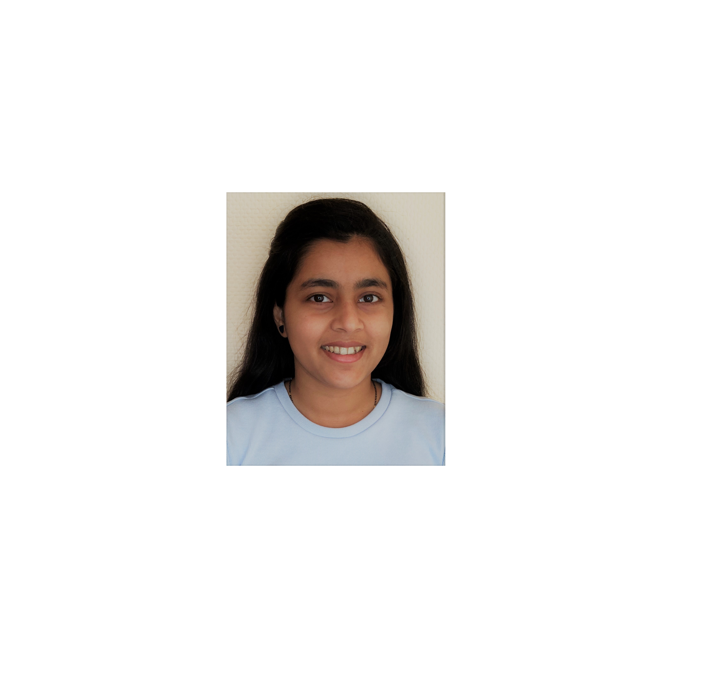

> # __*Kriti Amin*__
- Date of Birth : 05.12.1998
- Nationality : Indian
- Place of birth : [Mumbai](https://en.wikipedia.org/wiki/Navi_Mumbai)



# Personal Information

## Contact
- email id : kritiamin6461@gmail.com
- mobile : +49-15738276173
- [GitLab](https://gitlab.informatik.uni-bonn.de/amink0)

## Address
- Essen, Germany


# Education
school/university name | start year | end year
-----------------------|------------|---------
University of Bonn | 10.2020 | 09.2022
Diploma in Bioinformatics | 06.2019 | 08.2020
Mumbai University | 06.2016 | 04.2019


# Places visited

- India
  - Maharshtra
    - Mumbai
    - Pune  
  - Karnataka
    - Bangalore
  - Rajasthan
    - Jaipur
    - Ajmer
    - Udaipur
- Germany
  - NRW
    - Essen
    - Düsseldorf
    - Köln
    - Bonn 
  - Bayern
    - Munich


# Hobbies

Find common hobbies between us using the following code.

````python
def compare_hobbies(hobbies_list: list) -> list:
    """ Returns similar hobbies. """
    my_hobbies = ['reading', 'dancing', 'travelling', 'singing']
    common = set()
    for i in hobbies_list:
        for j in my_hobbies:
            if i == j:
                common.add(j)
    return common
````

