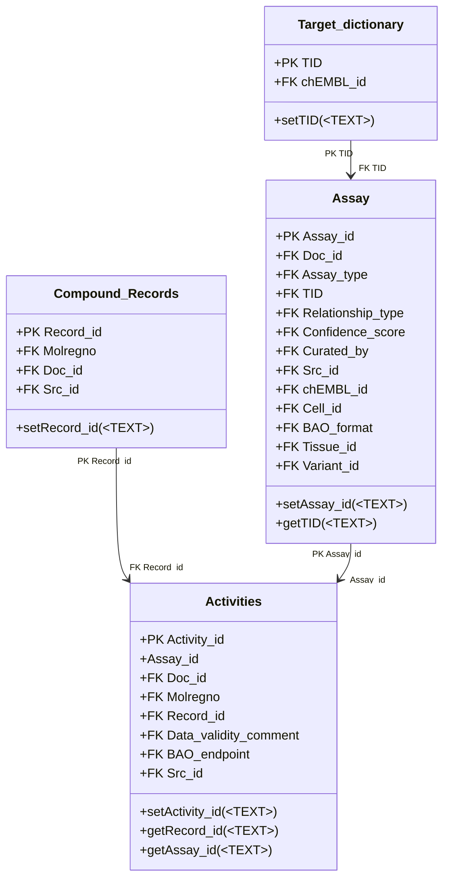

```mermaid
classDiagram

    class Compound_Records{
    +PK Record_id
    +FK Molregno
    +FK Doc_id
    +FK Src_id}
    Compound_Records : +setRecord_id(~TEXT~)

    class Activities{
    +PK Activity_id
    +Assay_id
    +FK Doc_id
    +FK Molregno
    +FK Record_id
    +FK Data_validity_comment
    +FK BAO_endpoint
     +FK Src_id}
    Activities:+setActivity_id(~TEXT~)
    Activities:+getRecord_id(~TEXT~)
    Activities : +getAssay_id(~TEXT~)

    class Assay{
        +PK Assay_id
        +FK Doc_id
        +FK Assay_type
        +FK TID
        +FK Relationship_type
        +FK Confidence_score
        +FK Curated_by
        +FK Src_id
        +FK chEMBL_id
        +FK Cell_id
        +FK BAO_format
        +FK Tissue_id
        +FK Variant_id
    }
    Assay :+setAssay_id(~TEXT~)
    Assay : +getTID(~TEXT~)


    class Target_dictionary{
        +PK TID
        +FK chEMBL_id
    }
    Target_dictionary : +setTID (~TEXT~)

    Compound_Records "PK Record_id" --> "FK Record_id" Activities
    Assay "PK Assay_id" --> "Assay_id" Activities
    Target_dictionary "PK TID" --> "FK TID" Assay    
```

